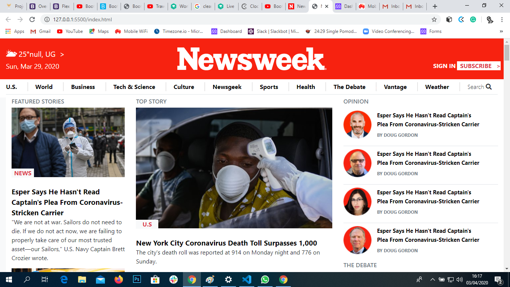

# Newsweek-clone

This is the newsweek.com web clone project on a concept to build a responsive web layout using bootstrap framework.

Screenshot of Page

 

## Built With

- Html,
- Css
- Bootstrap framework

[Live Demo Link](https://raw.githack.com/Samitti/Newsweek-clone/homepage/index.html)

## About
Th aim of the project is to build a responsive web page using the bootstrap framework, in this case we cloned the  [newsweek.com](https://www.newsweek.com/). 

It contains an exact copy of the layout, and similar functionality and the same user experience.

## Author

👤 **Samuel Teweldebrhan Ghebremeskel**

- Github: [@githubhandle](https://github.com/Samitti)
- Twitter: [@twitterhandle](https://twitter.com/Samuel63734232)
- Linkedin: [linkedin](https://www.linkedin.com/in/samuelghebremeskel/)

## 🤝 Contributing

Contributions, issues and feature requests are welcome!

Feel free to check the [issues page](https://github.com/Samitti/Newsweek-clone/issues).

## Show your support

Give a ⭐️ if you like this project!

